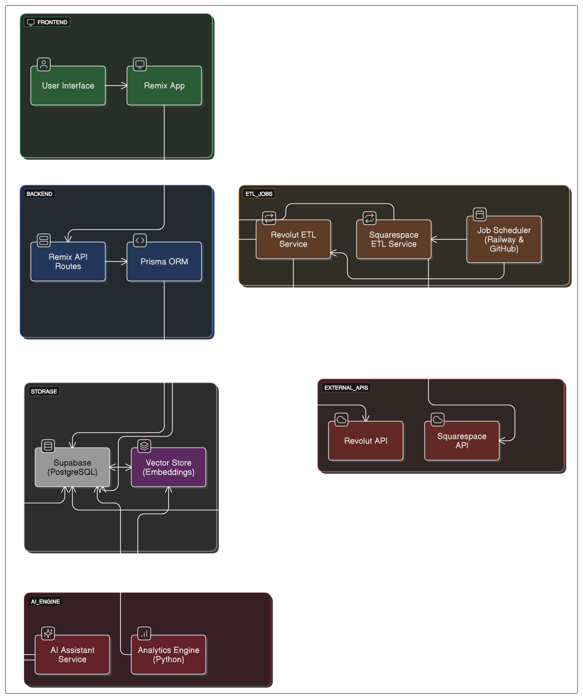

# 🧠 Threadwise

**Smart Financial Insights & Forecasting for Modern Brands**

`Threadwise` is an AI-powered dashboard and assistant designed to help clothing and lifestyle brands intelligently monitor cash flow, analyze inventory costs, and forecast financial trends. Built with a modern full-stack architecture, `threadwise` integrates your business data sources like **Revolut** and **Squarespace**, processes them through ETL pipelines, and brings you actionable insights through a powerful, conversational AI interface.

---

## 🚀 Features

- 📊 **Cash Flow & Inventory Cost Analysis**  
  Aggregates real-time financial and product data from Revolut and Squarespace.

- 🧠 **AI Assistant**  
  Powered by LLMs and a vector database for querying and navigating your financial landscape conversationally.

- 📈 **Forecasting Engine**  
  Uses Python-based statistical and ML models for predicting future trends like runway, cost spikes, or revenue flow.

- 🧰 **Custom ETL Pipeline**  
  Scheduled data syncing and transformation via ETL microservices and cloud cron jobs.

- 📦 **Built on Open Tools**  
  Powered by Remix, Supabase, Prisma, and FastAPI — easy to extend and self-host.

---

## 🧱 Architecture

  
*(View editable diagram: [Eraser.io Diagram](https://eraser.io))*

Main components:

- **Frontend**: React + Remix (API routes)
- **Database**: Supabase (PostgreSQL) + Prisma
- **ETL Jobs**: Node.js or Python microservices for Revolut and Squarespace
- **AI Engine**: Python (FastAPI) service with embeddings + forecasting
- **Scheduler**: Railway or GitHub Actions for background jobs
- **Storage**: Supabase + optional Vector Store for AI

---

## 🛠️ Tech Stack

| Layer       | Technology                          |
|------------|--------------------------------------|
| Frontend   | Remix, React Router, Tailwind CSS    |
| Backend    | Remix API Routes, Prisma ORM         |
| Database   | Supabase (PostgreSQL)                |
| AI Engine  | Python (FastAPI, Pandas, Prophet)    |
| ETL Layer  | Node.js / Python Services            |
| Scheduler  | Railway Cron / GitHub Actions        |
| Embeddings | pgvector or external vector DB       |

---

## 🧪 Local Development

1. **Install dependencies**
   ```bash
   pnpm install
   cd etl && pip install -r requirements.txt
