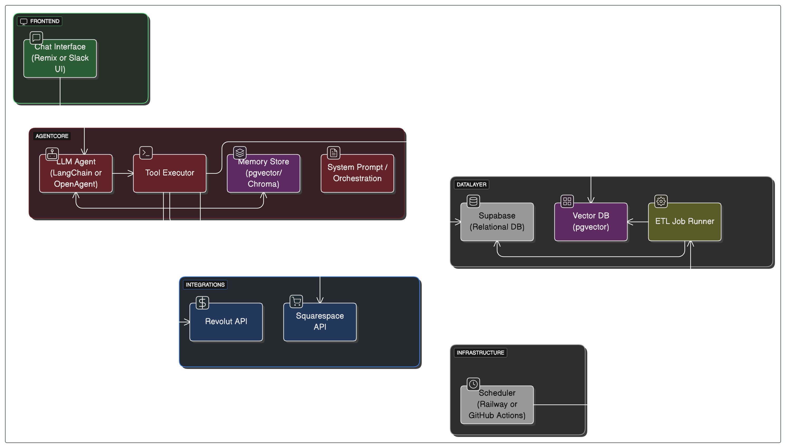

# 🧠 Threadwise

**Threadwise** is an intelligent, context-aware AI Agent designed to act as your always-on business co-pilot for financial operations. Instead of static dashboards or fragmented tools, Threadwise offers a conversational interface that enables users to interact naturally with their business data — ask questions, generate insights, and take action, all through a unified AI assistant.

---

## ✨ Project Vision

Threadwise pivots away from traditional UI-heavy platforms and focuses on a fully Agent-centric experience:

- 💬 Talk to your business via a chat-based interface
- 📊 Generate real-time financial insights on demand
- 🔁 Perform tasks like cost breakdowns, trend forecasting, and more
- 🔌 Connect seamlessly to third-party services (e.g., Revolut, Squarespace)

The user’s primary interaction is through the **AI Agent**, not dashboards. The agent is powered by a persistent memory architecture that understands the business context and can act intelligently.

---

## 💡 Core Features

- **Conversational Agent UI** – Natural language chat interface
- **Unified Business Memory** – Powered by Model Context Protocol (MCP)
- **Integrated Data Sources** – Real-time sync with Revolut, Squarespace, etc.
- **Action Execution** – Trigger business tasks (e.g., reports, cost analysis)
- **Insight Cards** – On-demand visual summaries for key metrics
- **ETL Automation** – Scheduled data ingestion from external services

## 🧱 Architecture

  
_(View editable diagram: [Eraser.io Diagram](https://eraser.io))_

---

## 🧱 Tech Stack

### Frontend

- **Remix** – Fullstack React framework
- **Tailwind CSS** – Utility-first styling
- **shadcn/ui** + **Framer Motion** – UI components and animations
- **tRPC** (optional) – Type-safe backend communication

### AI & Agent

- **LangChain** or **OpenAgents** – Agent framework
- **OpenAI / Claude / Mistral** – LLM providers
- **Model Context Protocol (MCP)** – Persistent structured context
- **Custom Tools** – Business-specific actions (`generateReport`, `getCashflow`)

### Data & Infrastructure

- **Node.js / Python** – ETL scripts for Revolut and Squarespace
- **Supabase** – Postgres DB + auth + file storage
- **Prisma ORM** – Type-safe data access layer
- **Railway / GitHub Actions** – Scheduling and deployment

---

## 📦 Monorepo Structure

```bash
apps/
  remix/           → Remix frontend and API handlers
  agent/           → LangChain or OpenAgents logic

packages/
  prisma/          → Shared schema and type definitions
  etl/             → Data ingestion scripts (Revolut, Squarespace)
  supabase/        → Supabase client and migrations
```
